# 🚀 Start/Stop de Instâncias na Oracle Cloud (OCI)

Este guia mostra como configurar e gerenciar o ciclo de **start/stop automático de instâncias** na Oracle Cloud Infrastructure (OCI), utilizando **Instance Configurations**, **Instance Pools** e **Autoscaling Configurations**.

## 📌 Pré-requisitos

* Uma conta na [Oracle Cloud](https://www.oracle.com/cloud/).
* Permissão para criar **Instance Configurations**, **Instance Pools** e **Autoscaling Configurations**.
* Rede configurada (VCN e Subnet).
* Instâncias existentes (para anexar ao pool).

---

## 🔹 1. Acessando o menu Compute

- O primeiro passo é criar uma configuração de instância (Instance configurations).

No painel lateral da Oracle Cloud, clique em:

`☰ Menu → Compute → Instance Configurations`


---

## 🔹 2. Criando uma Instance Configuration

- Vamos criar uma configuração de instância, irei usar os padrões para Imagem e Shape, ele não será importante pois iremos utilizar o configurado na instância criada.
  
1. Clique em **Instance Configurations**.
2. Selecione **Create instance configuration**.

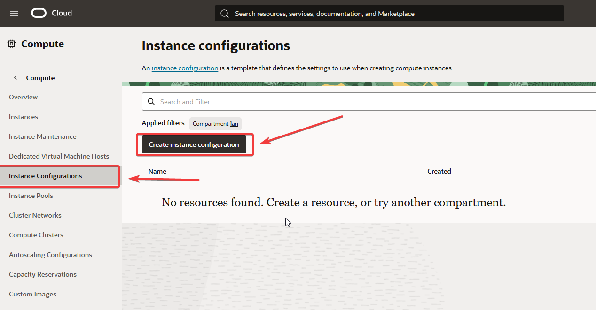

3. Defina as informações básicas:

   * **Name**: `instance-config-start-stop`
   * **Compartment**: Selecione o compartment desejado.

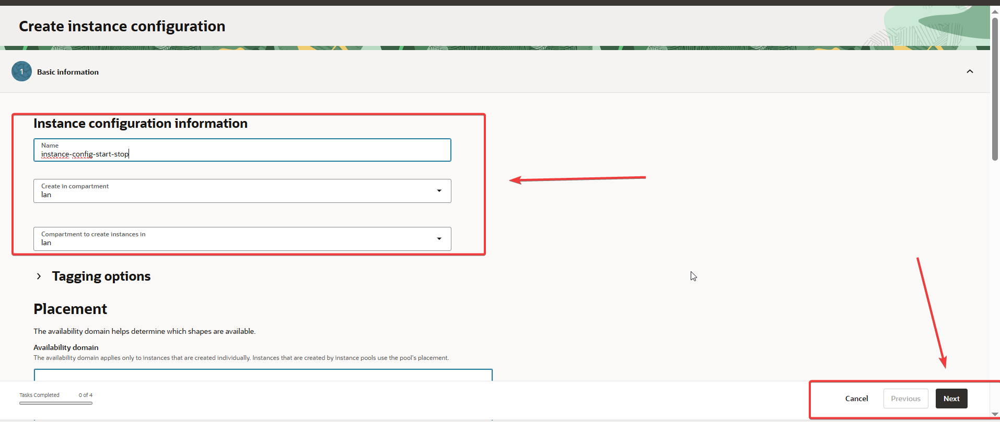

4. Clique em **Next** e finalize.
5. Sua configuração estará disponível:

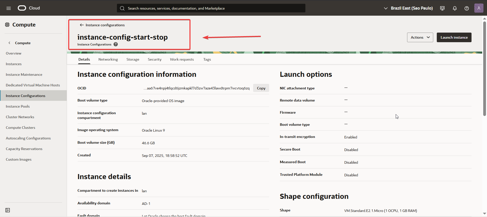

---

## 🔹 3. Criando um Instance Pool

Agora vamos criar um **Instance Pool** baseado na configuração criada.

1. Acesse:
   `☰ Menu → Compute → Instance Pools`

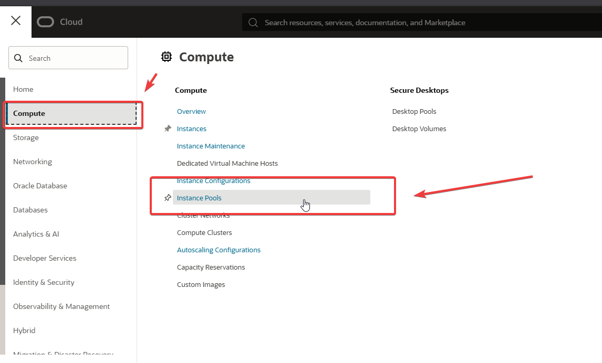

2. Clique em **Create instance pool**.

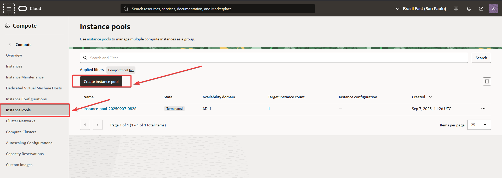

3. Configure os detalhes:

   * **Name**: `instance-pool-start-stop`
   * **Number of instances**: `0` (para iniciar/parar manualmente quando necessário).
   * **Instance configuration**: Selecione `instance-config-start-stop`.

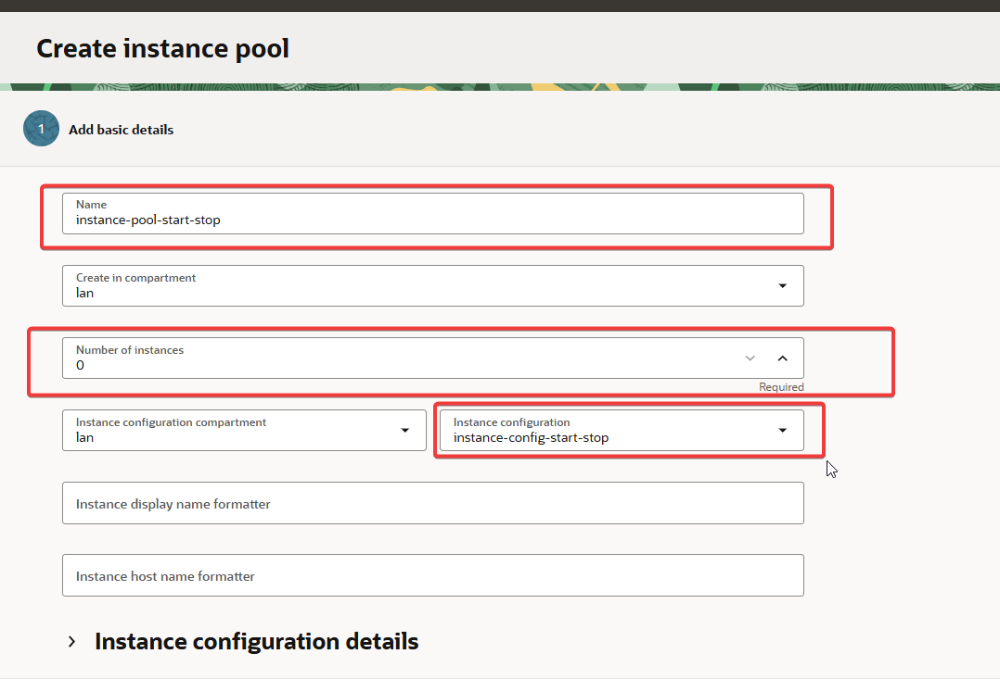

4. Configure o **Placement**:
   
- Selecione o Domínio (isso é importante), deve ser o mesmo que está a instância que irá fazer parte do Start Stop, se ele estiver em outro domínio você não conseguirá anexar ela futuramente.
  
   * Escolha o **Availability Domain**.
   * Configure o **Primary VNIC** (rede e subnet).

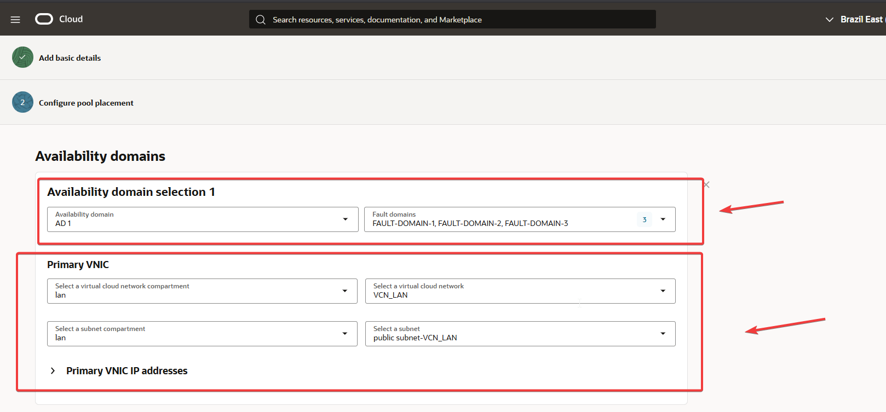

5. Finalize a criação do pool.
- Ao final do processo, ao clicar em Create, ele irá apresentar um resumo

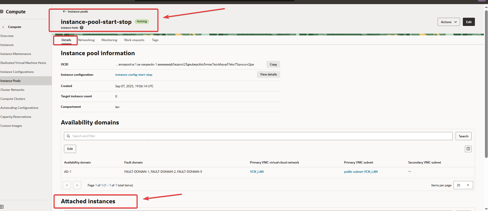

---

## 🔹 4. Anexando Instâncias ao Instance Pool

Para adicionar instâncias existentes ao pool:

- No momento ão tem nenhuma instância anexada, iremos anexar as instâncias que desejamos que faça parte do Start e Stop do agendamento.
  
1. No seu Instance Pool, vá para a seção **Attached instances**
2. Clique em **Attach instance**

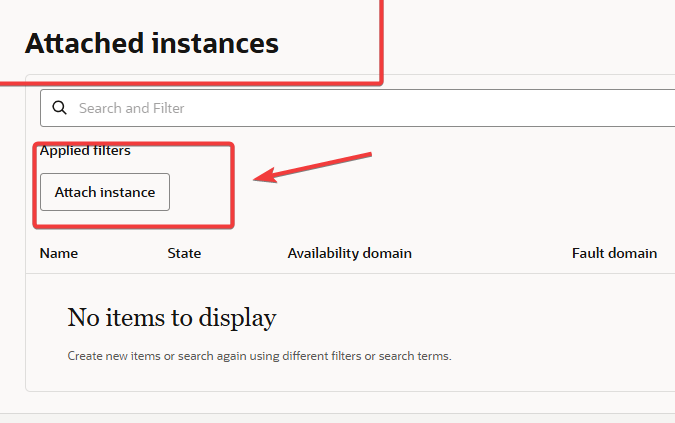

3. Selecione a instância que deseja anexar
4. Verifique se a instância atende aos requisitos:
   - Instância e pool estão em execução
   - Mesmo tipo de máquina (VM ou bare metal)
   - Mesmo availability domain e fault domain
   - VNIC primária na mesma VCN e subnet
   - Não está anexada a outro pool

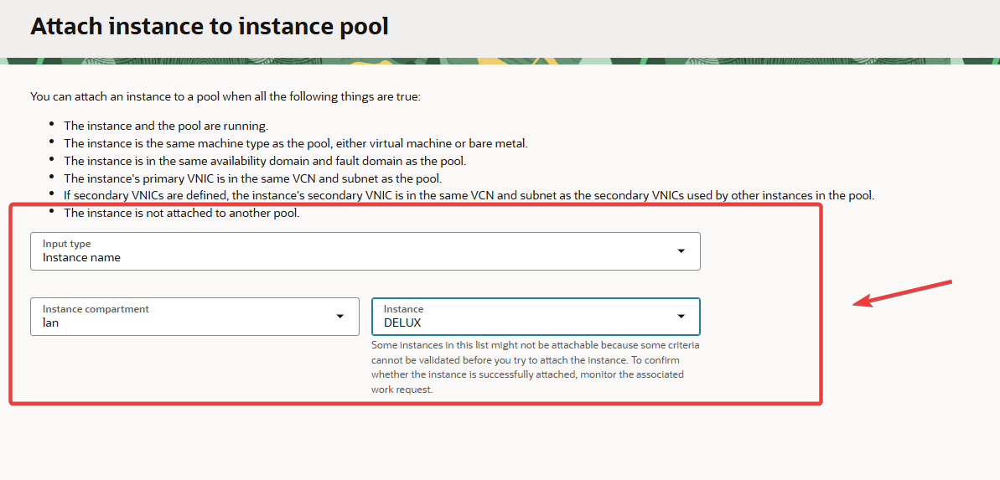

5. Monitore o progresso em **Work requests** → **AttachInstancePoolInstance**

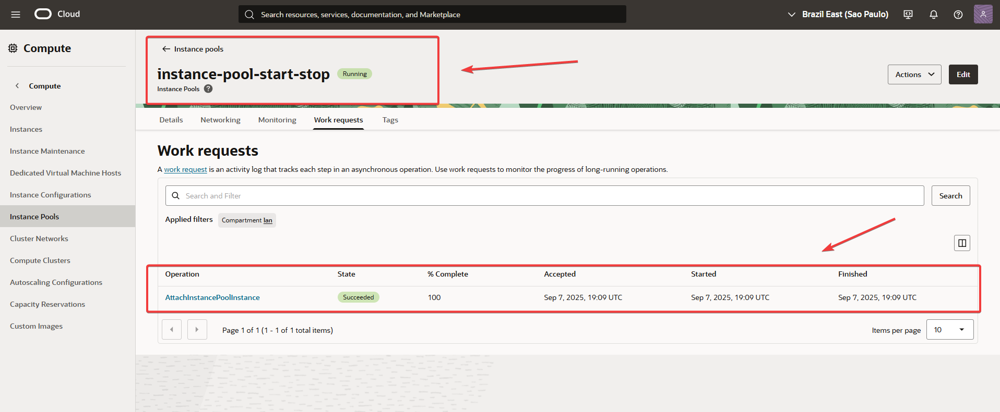

---

## 🔹 5. Configurando Auto Scaling para Start/Stop Automático

### Criando Autoscaling Configuration

1. Acesse: `☰ Menu → Compute → Autoscaling Configurations`
2. Clique em **Create autoscaling configuration**


3. Configure os detalhes básicos:
   - **Name**: `autoscaling-config-start-stop`
   - **Compartment**: Selecione o compartment
   - **Instance pool**: Selecione `instance-pool-start-stop`


### Configurando Política de Stop (Desligamento)

1. Selecione **Schedule-based autoscaling**
2. Configure a política de stop:
   - **Policy name**: `autoscaling-policy-stop`
   - **Action**: `Change lifecycle state of all instances`
   - **Lifecycle action**: `Force stop`
   - **Schedule**: Configure o cron expression para o horário desejado

Exemplo de configuração cron:
```
Minute: 30
Hour: 19
Day of month: 1-31
Month: 9
Day of week: ?
Year: 2025
```


### Configurando Política de Start (Ligamento)

1. Adicione uma segunda política
2. Configure a política de start:
   - **Policy name**: `autoscaling-policy-start`
   - **Action**: `Change lifecycle state of all instances`
   - **Lifecycle action**: `Start`
   - **Schedule**: Configure o cron expression para o horário desejado

Exemplo de configuração cron:
```
Minute: 25
Hour: 19
Day of month: 1-31
Month: 9
Day of week: ?
Year: 2025
```


### Configuração Final do Autoscaling

Após configurar ambas as políticas, você terá:

- ✅ Política de stop agendada
- ✅ Política de start agendada  
- ✅ Próximos eventos visíveis no painel


---

## 🔹 6. Monitoramento e Gerenciamento

### Verificando Instâncias Anexadas
- Acesse seu Instance Pool → **Attached instances**
- Verifique se as instâncias estão listadas corretamente

### Monitorando Work Requests
- Acesse **Work requests** para ver o histórico de operações
- Verifique o status das operações de attach/detach

### Gerenciando o Autoscaling
- Acesse **Autoscaling Configurations** para editar políticas
- Verifique os próximos eventos agendados
- Desabilite políticas temporariamente se necessário

---

## ⚠️ Considerações Importantes

1. **Custos**: Instâncias em pool paradas ainda incorrem em custos de armazenamento
2. **Rede**: Todas as instâncias devem estar na mesma VCN/subnet
3. **Agendamento**: Horários são sempre em UTC
4. **Monitoramento**: Verifique sempre os work requests para garantir sucesso nas operações
5. **Compatibilidade**: Instâncias devem ser do mesmo tipo (VM/bare metal)

---

## 🎯 Conclusão

Com esta configuração completa, você terá:

- ✅ Instance Pool configurado com instâncias anexadas
- ✅ Políticas de auto scaling para start/stop automático
- ✅ Controle total sobre quando as instâncias ligam/desligam
- ✅ Economia de custos com desligamento programado
- ✅ Facilidade de gerenciamento através do console OCI

Agora suas instâncias serão automaticamente ligadas e desligadas conforme o agendamento configurado! 🚀
